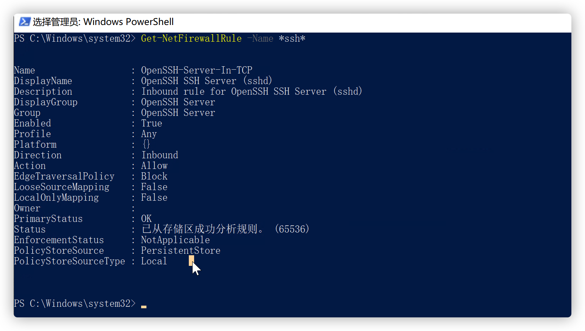

#### Mac 已安装软件清单

1.[Chrome](https://www.google.com/chrome/) (浏览器)

2.[Qspace Pro](https://qspace.awehunt.com/zh-cn/index.html) (多视图文件管理工具)

3.[iTerm 2](https://iterm2.com/) (终端工具)

4.[Dash](https://kapeli.com/dash) (文档查阅)

5.[Microsoft Remote Desktop](https://apps.apple.com/us/app/microsoft-remote-desktop/id1295203466?mt=12) (远程控制Windows 或者Linux[需要配置xrdp])[国外区Mac App Store 下载]

6.[Typora](https://typora.io/) (Markdown 编辑器)

7.[WeChat](https://mac.weixin.qq.com/?t=mac&lang=zh_CN) (聊天工具)

8.[Alfred](https://www.alfredapp.com/) (快捷指令工具)

8.1 [Raycast](https://www.raycast.com/) (快捷指令工具,可进行分屏操作快捷键)

9.[VVebo](https://apps.apple.com/cn/app/vvebo/id670910957) (新浪微博第三方客户端) [Mac App Store 下载]

10.[Clash for Windows](https://github.com/Fndroid/clash_for_windows_pkg/releases) (支持macOS)

11.[Mounty](https://mounty.app/) (macOS 读取NTFS 文件系统工具)

12.[The UnArchiver](https://theunarchiver.com/) (解压缩工具)

13.[iShot](https://www.better365.cn/ishot.html) (解图工具)

14.[Folx](https://www.mac-downloader.com/) (多线程下载工具)

15.[Tencent Lemon](https://lemon.qq.com/) (磁盘清理工具)

16.[Eudic](https://www.eudic.net/v4/en/app/eudic) (欧路词典)

17.[IINA](https://iina.io/) (视频播放工具)

18.[Macs Fan Control](https://crystalidea.com/macs-fan-control) (macOS 控制风扇工具)

19.[Wireshark](https://www.wireshark.org/) (抓包工具)

20.[Xmind](https://www.xmind.net/xmind8-pro/) (思维导图)

21.[Infuse](https://firecore.com/infuse) (视频播放工具,对HDR支持较好)

22.[QQ](https://im.qq.com/macqq/) (聊天工具)

23.[Zoom](https://zoom.us/) (远程视频会议)

24.OneDrive (微软出品的网盘)

25.[PDF EXpert](https://pdfexpert.com/zh) (pdf 阅读器)

26.[Hidden Bar](https://github.com/dwarvesf/hidden) (macOS 状态栏隐藏工具)

27.[Drafts](https://getdrafts.com/) (文本处理应用,iOS 与macOS 之间能够自动同步)

28.[Pycharm](https://www.jetbrains.com/pycharm/) (Python IDE)

29.[Downie 4](https://software.charliemonroe.net/downie/)  (下载工具)[需要安装对应浏览器的扩展]

30.[Permute](https://software.charliemonroe.net/permute/) (视频转换工具)

31.[foobar2000](https://www.foobar2000.org/mac) (音乐播放工具)

32.[XQuartz](https://www.xquartz.org/) (X11.app)

33.[iMazing](https://imazing.com/)  (iPhone 管理工具)

34.[Maipo](https://weiboformac.sinaapp.com/) (微博macOS 客户端)

35.[YouTube-Music](https://github.com/steve228uk/YouTube-Music) (YouTube Music 第三方客户端)

36.[Amphetamine](https://apps.apple.com/app/amphetamine/id937984704?mt=12) (macOS 防止休眠应用)

37.[AirBuddy](https://v2.airbuddy.app/)  (使Mac 像iOS一样显示耳机的弹出窗口)

38.[Stats](https://github.com/exelban/stats)  (Mac System Monitor App)

39.[fliqlo](https://fliqlo.com/screensaver/)

40.[obsidian](https://obsidian.md/)  (Zettelkasten 笔记法的笔记管理软件)

41.Balance Lock (修复Mac 音量平衡自动漂移的软件)

42. [AltTab](https://alt-tab-macos.netlify.app/) (像windows 一样使用Alt-Tab,macOS 下快捷键为Option + Tab 键)

[Warp](https://www.warp.dev/) (The terminal for the 21st century)

[Fig](https://fig.io/) (Fig adds IDE-style autocomplete to your existing terminal. Move faster with Fig.)


#### Podcast

[GGtalk](https://talk.swift.gg/)

[捕蛇者说](https://pythonhunter.org/)

[牛油果烤面包](https://avocadotoast.live/)

[Go夜聊](https://talkgo.fm/)

[Teahour](https://teahour.fm/)

[Changelog](https://changelog.com/podcast)

[Command Line Heroes](https://www.redhat.com/en/command-line-heroes)

[内核恐慌](https://pan.icu/)

[代码时间](https://www.ximalaya.com/keji/4867505/)

[The Stack Overflow Podcast](https://stackoverflow.blog/podcast/)

[FM3.14](https://podcasts.apple.com/cn/podcast/id1492046083)

[PyTorch Developer Podcast](https://pytorch-dev-podcast.simplecast.com/)

[Rust Talk](https://rusttalk.github.io/podcast/)


#### Salary Search

https://salaryfly.com/

https://www.ioffershow.com/

https://www.glassdoor.com/Salaries/index.htm

https://www.levels.fyi/

#### 天气查询

[中央气象台(nmc.cn)](http://www.nmc.cn/)

[windy.com](https://www.windy.com/)


#### 设置macOS HostName

```shell
sudo scutil --set HostName set-you-want-hostname
```

参考

- [搞懂 macOS 上的主机名/hostname/ComputerName](https://shockerli.net/post/macos-hostname-scutil/)


#### 设置macOS Magic Mouse 与TrackPad 灵敏度

查看Magic Mouse 灵敏度

```
defaults read -g com.apple.mouse.scaling
```


设置Macgic Mouse 灵敏度

```
defaults write -g com.apple.mouse.scaling 5
```


设置TrackPad 与Magic Mouse 类似,将mouse 改为trackpad 即可

```shell
houjie@houjiedeMacBook-Pro MacSoftware % defaults read -g com.apple.trackpad.scaling
5
houjie@houjiedeMacBook-Pro MacSoftware % defaults write -g com.apple.trackpad.scaling 5
```


#### iTerm 相关配置

##### 1.悬浮窗口

需求: 希望在打开网页或者其他窗口时能有使用快捷键快速的呼出iTerm 2 终端.然后同样适用快捷键进行隐藏

具体配置步骤如下:

###### 创建新的Profile

打开iTerm 的 `perference` -> `profile`,创建新的 `profile`并改名为 `HotKey Window`


###### 设置透明度


###### 设置窗口风格


- **Full-Width Top of Screen** : 让终端显示在屏幕顶部，并占满整个宽度。
- **Current Spce** : 表示只显示在当前的工作空间,假设你在当前屏幕打开了终端，你切换到下一个屏幕时它就不会跟到下一个屏幕。
- **Screen width Cursor** : 这个和上面的参数搭配，用来判定哪个屏幕属于当前的工作空间，表示你的鼠标在哪，哪里就是当前的工作空间

###### 设置快捷键

`perference-> profile->keys->HotKey window`


点击 `Configure Hotkey Windows`按钮进行配置快捷键选项


要使得能够添加一个键作为iTerm 快捷键,需要做一些额外的配置

打开 `系统偏好设置` 选中 `键盘`


然后在 `快捷键`-> `功能键中添加iTerm 2`


#### 2.iTerm 2 添加SSH 连接

##### 1.新建profile,并设置登录commnad

登录command 格式为 `ssh user@ip -p port`


##### 2.添加触发器,配置密码

选择 `Advanced` 编辑Triggers


配置Triggers 参数(Parameters 参数为登录密码并添加 `\n`参数)


##### 3. 配置快捷键

勾选 `A hotkey opens a dedicated windows with this profile`


配置快捷键


#### iTerm 2 配置X-Window

为了能直接在macOS 中打开 `virt-manager`,发现在 `iTerm 2`中直接打开iTerm 2 会报错,查阅资料后发现需要给iTerm 2 配置以实现X11图形化界面显示.


在远程服务端需要修改部分sshd配置

添加或者取消注释如下参数

```
X11Forwarding yes
X11DisplayOffset 10
X11UseLocalhost yes
```

修改完成后执行命令`systemctl restart sshd`重启sshd


```
# macOS安装xquartz
brew install xquartz

# 启动xquartz，实测`Allow connections from clients`选项非必须条件
Run Applications > Utilities > XQuartz.app

# 设置DISPLAY环境变量
export DISPLAY=:0


# 允许服务器的的x11界面连接过来
xhost +　　

# 适用ssh -Y 来登录终端
ssh -Y root@192.168.117.148

# 登录终端后使用virt-manager来打开终端,响应过程有些缓慢,耐心等待即可

```


#### macOS 快捷键

#### install Golang(Linux Version)

1.Download go archive file

```shell
wget https://golang.org/dl/go1.16.6.linux-amd64.tar.gz
```

2.Extract archive file

**if you want to delete previous go file, please run  `rm -rf /usr/local/go`**

```shell
tar -C /usr/local -xzf go1.16.6.linux-amd64.tar.gz
```

3.Add env to PATH (add to `$HOME/.profile or /etc/profile`)

```
export PATH=$PATH:/usr/local/go/bin
source /etc/profile
```

4.Verify go version

```
go version
```

5.Set go proxy for fast speed on download go module

```
echo "export GO111MODULE=on" >>/etc/profile
echo "export GOPROXY=https://goproxy.cn" >> /etc/profile
source /etc/profile
```

快捷键

1.Mac 如何在预览中使得图片能够翻页

使用Command + A 全选图片，然后按空格即可打开预览窗口，打开的窗口会有翻页的选项。

2.Mac 中如何打开一个新的Finder 窗口

快捷键 Command + N

3.打开应用程序的偏好设置

快捷键 Command + ,


---


### Windows 添加SSH支持

系统需要是Windows10系统

需要安装OpenSSH Server端,首先设置中找到应用的功能

推荐使用PowerShell命令来安装


1.查询openssh 是否存在

```powershell
Get-WindowsCapability -Online | ? Name -like 'OpenSSH*'
```

输出结果类似于


2.使用powershell 安装openssh

```
Add-WindowsCapability -Online -Name OpenSSH.Server~~~~0.0.1.0
```

安装过程中...


安装完成后


3.启动sshd

```
Start-Service sshd
```

设置服务自启动

```
Set-Service -Name sshd -StartupType 'Automatic'
```

确认防火墙是否开启

```
Get-NetFirewallRule -Name *ssh*
```

观察**OpenSSH-Server-In-TCP** 参数是否为enabled



4.连接ssh

连接和普通ssh连接一样

```
ssh root@192.168.2.101
```

根据提示输入密码即可进入


5.将默认的shell替换为powershell

在openssh的注册表中增加一个项

注册表路径为**HKEY_LOCAL_MACHINE\SOFTWARE\OpenSSH** 

项的名称为**DefautlShell**

项的值为**C:\Windows\System32\WindowsPowerShell\v1.0\powershell.exe**


也可以用powershell 命令的方式来完成上述操作

```
New-ItemProperty -Path "HKLM:\SOFTWARE\OpenSSH" -Name DefaultShell -Value "C:\Windows\System32\WindowsPowerShell\v1.0\powershell.exe" -PropertyType String -Force
```

执行及输出结果如下


